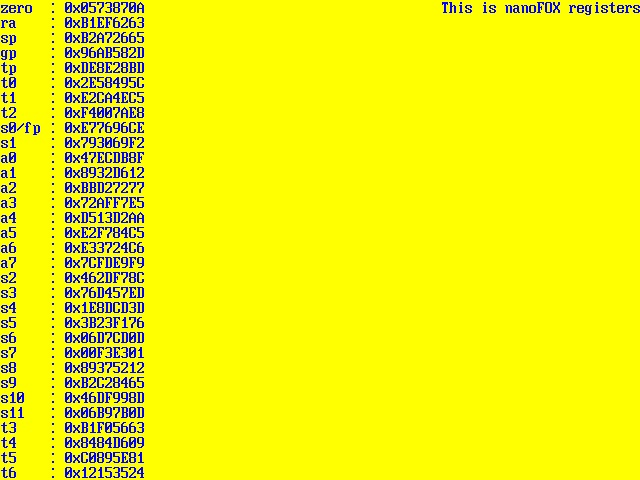
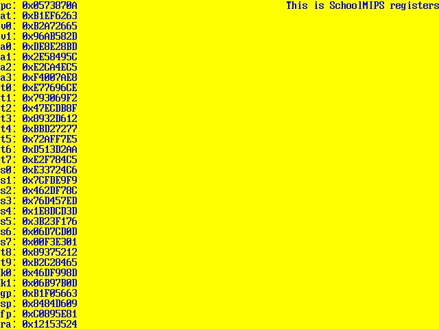

# DebugScreenCore

## DebugScreenCore ( VGA 640 * 480 60 Hz )
vga_top is top module DebugScreenCore

### Clock, reset, enable inputs:
*   clk for connecting clock from pll (25.175 MHz) or from input pin of FPGA 50 Mhz or 100 MHz;
*   resetn for connecting reset pin;
*   en is enable input. When clk input is connected from pll, en must be 1. When clk is connected from input pin of FPGA (50 or 100 MHz), en input must switch.
### VGA signals:
*   hsync is output pin for horisontal synchronization;
*   vsync is output pin for vertical synchronization;
*   R is output pin for connecting Red color to VGA;
*   G is output pin for connecting Green color to VGA;
*   B is output pin for connecting Blue color to VGA.
### Core side scanning signals:
*   regAddr is output bus for scanning register file;
*   regData is input bus for scanning value from register file.
### Color of foreground (symbols) and background:
*   bgColor defined background color;
*   fgColor defined foreground color (symbols color).

Example of connection vga_top described in vga_debug_screen.sv or vga_debug_screen.vhd files.

## VGA output example for nanoFOX core

## VGA output example for schoolMIPS core

